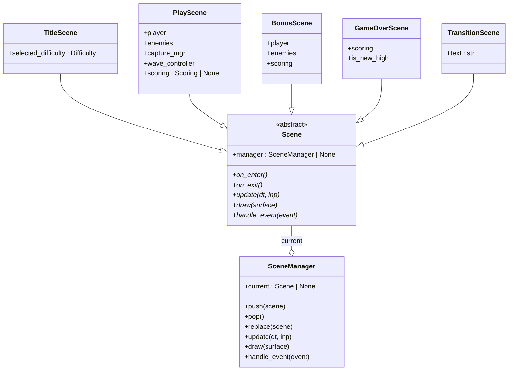
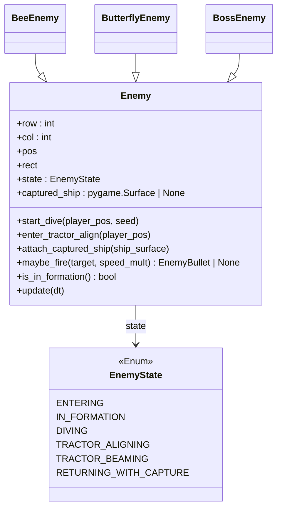
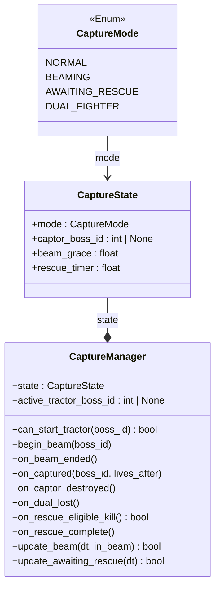
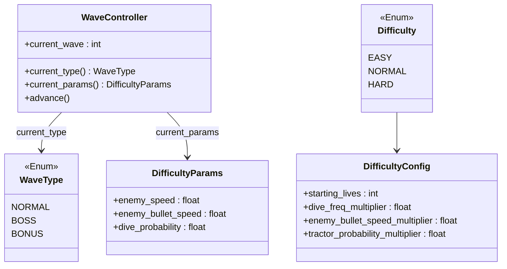
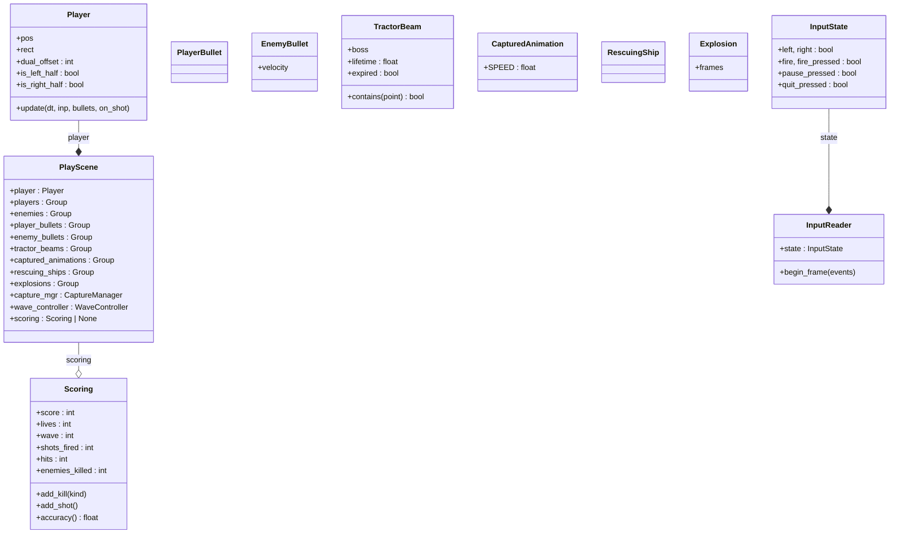
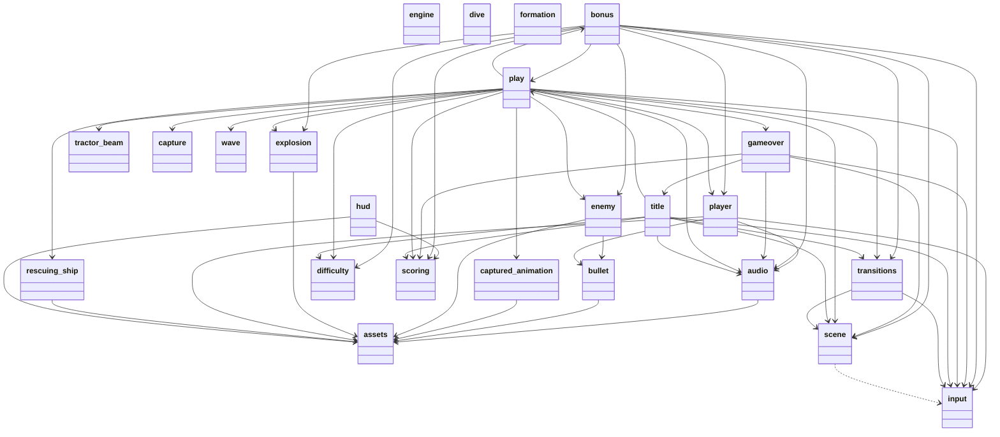

# Galaga Clone

Single-player Galaga clone built in Python + Pygame. Personal/learning project.

See [docs/superpowers/specs/2026-05-02-galaga-clone-design.md](docs/superpowers/specs/2026-05-02-galaga-clone-design.md) for the design spec.

## Features

- Authentic 5x8 enemy formation with curved entry paths
- Dive attacks with sine-wave wobble
- Wave cycle: 4 normal -> 1 boss -> 1 bonus, repeating, with rising difficulty
- Bonus (challenging) stages with perfect bonus (+10000 + extra life)
- Programmatically generated pixel sprites + chiptune music + SFX (no external assets)
- Persistent high score
- Side-panel HUD (score, lives, wave, accuracy, kills, controls)

## Setup

```powershell
python -m venv .venv
.venv\Scripts\Activate.ps1
pip install -e ".[dev]"
```

## Run

```powershell
python main.py
```

Assets (sprites + audio) are auto-generated on first run. To regenerate manually:

```powershell
python -m tools.generate_sprites
python -m tools.generate_audio
```

## Controls

- Arrow keys / A,D -- move
- Space -- fire (max 2 bullets on screen)
- P -- pause
- Esc -- quit

## Develop

```powershell
pytest         # tests
ruff check .   # lint
ruff format .  # format
```

## Architecture

The codebase is organised into four packages with one-way dependencies (`scenes` → `entities`/`game` → `engine`). Pure-logic packages (`game/*`) have no Pygame surface dependencies and are unit-tested directly.

| Package | Role |
|---|---|
| `engine/` | Reusable Pygame plumbing — assets, audio mixer, input edge-detection, scene stack |
| `entities/` | Game objects — Player, Enemy (BeeEnemy/ButterflyEnemy/BossEnemy), bullets, beams, animations |
| `game/` | Pure logic — wave cycle, formation grid math, dive paths, capture FSM, scoring, HUD |
| `scenes/` | High-level screens — title, play, bonus, game over, transitions |

### Class diagrams

Split per concern for readability. Full single-diagram source: [docs/uml/classes_Galaga.mmd](docs/uml/classes_Galaga.mmd) (also [.puml](docs/uml/classes_Galaga.puml), [.svg](docs/uml/classes_Galaga.svg), [.png](docs/uml/classes_Galaga.png)).

#### Scene hierarchy

Five scenes share the abstract `Scene` interface, managed by a stack-based `SceneManager` (`push` / `pop` / `replace`). Title → Play → Bonus/GameOver flow.



#### Enemy hierarchy

Three enemy types — Bee, Butterfly, Boss — share state machine and dive logic via `Enemy`. Boss can grow into a tractor-beam captor.



#### Capture FSM

Boss tractor-beam capture flow. On dual-fighter loss, the rescue window opens until eligible kill or timeout.



#### Difficulty + wave systems

Wave cycle is `4 normal → 1 boss → 1 bonus`, repeating with growing difficulty parameters per wave. Three player-selectable difficulty presets (`Difficulty`) layer on top.



#### Engine + entities composition

`PlayScene` aggregates the player, enemy formation, bullet pools, capture manager, wave controller, and scoring.



<details>
<summary>Show full single-diagram class diagram (wide)</summary>



</details>

```mermaid
classDiagram
  class BeeEnemy {
    score_kind : str
    sprite_name : str
  }
  class BonusScene {
    difficulty
    enemies
    explosions
    player
    player_bullets
    players
    playfield : NoneType
    scoring
    draw(surface) None
    update(dt, inp) None
  }
  class BossEnemy {
    score_kind : str
    sprite_name : str
  }
  class ButterflyEnemy {
    score_kind : str
    sprite_name : str
  }
  class CaptureManager {
    active_tractor_boss_id : int | None
    state
    begin_beam(boss_id) None
    can_start_tractor(boss_id) bool
    on_beam_ended() None
    on_captor_destroyed() None
    on_captured(boss_id, lives_after) None
    on_dual_lost() None
    on_rescue_complete() None
    on_rescue_eligible_kill() bool
    update_awaiting_rescue(dt) bool
    update_beam(dt, in_beam) bool
  }
  class CaptureMode { name }
  class CaptureState {
    beam_grace : float
    captor_boss_id : int | None
    mode
    rescue_timer : float
  }
  class CapturedAnimation {
    SPEED : float
    boss
    image
    pos
    rect
    update(dt) None
  }
  class Difficulty { name }
  class DifficultyConfig {
    dive_freq_multiplier : float
    enemy_bullet_speed_multiplier : float
    starting_lives : int
    tractor_probability_multiplier : float
  }
  class DifficultyParams {
    dive_probability : float
    enemy_bullet_speed : float
    enemy_speed : float
  }
  class Enemy {
    captured_ship : pygame.Surface | None
    col : int
    image
    pos
    rect
    row : int
    score_kind : str
    sprite_name : str
    state : EnemyState
    attach_captured_ship(ship_surface) None
    enter_tractor_align(player_pos) None
    is_in_formation() bool
    maybe_fire(target, speed_multiplier) EnemyBullet | None
    start_dive(player_pos, seed) None
    update(dt) None
  }
  class EnemyBullet {
    image
    pos
    rect
    velocity
    update(dt) None
  }
  class EnemyState { name }
  class Explosion {
    frames
    image
    rect
    update(dt) None
  }
  class GameOverScene {
    is_new_high
    scoring
    draw(surface) None
    update(dt, inp) None
  }
  class InputReader {
    state
    begin_frame(events) None
  }
  class InputState {
    fire : bool
    fire_pressed : bool
    left : bool
    pause_pressed : bool
    quit_pressed : bool
    right : bool
  }
  class PlayScene {
    capture_mgr
    captured_animations
    difficulty
    enemies
    enemy_bullets
    explosions
    player
    player_bullets
    players
    rescuing_ships
    scoring : Scoring | None
    tractor_beams
    wave_controller
    draw(surface) None
    on_enter() None
    update(dt, inp) None
  }
  class Player {
    dual_offset : int
    image
    is_left_half : bool
    is_right_half : bool
    pos
    rect
    update(dt, inp, bullets, on_shot) None
  }
  class PlayerBullet {
    image
    pos
    rect
    update(dt) None
  }
  class RescuingShip {
    image
    pos
    rect
    update(dt) None
  }
  class Scene {
    manager : SceneManager | None
    draw(surface)* None
    handle_event(event)* None
    on_enter()* None
    on_exit()* None
    update(dt, inp)* None
  }
  class SceneManager {
    current : Scene | None
    draw(surface) None
    handle_event(event) None
    pop() None
    push(scene) None
    replace(scene) None
    update(dt, inp) None
  }
  class Scoring {
    enemies_killed : int
    hits : int
    lives : int
    score : int
    shots_fired : int
    wave : int
    accuracy() float
    add_kill(kind) None
    add_shot() None
    gain_life() None
    lose_life() None
  }
  class TitleScene {
    selected_difficulty : Difficulty
    draw(surface) None
    on_enter() None
    on_exit() None
    update(dt, inp) None
  }
  class TractorBeam {
    boss
    expired : bool
    lifetime : float
    rect
    contains(point) bool
    draw(surface) None
    update(dt) None
  }
  class TransitionScene {
    text : str
    draw(surface) None
    update(dt, inp) None
  }
  class WaveController {
    current_wave : int
    advance() None
    current_params() DifficultyParams
    current_type() WaveType
  }
  class WaveType { name }
  BeeEnemy --|> Enemy
  BossEnemy --|> Enemy
  ButterflyEnemy --|> Enemy
  BonusScene --|> Scene
  GameOverScene --|> Scene
  PlayScene --|> Scene
  TitleScene --|> Scene
  TransitionScene --|> Scene
  InputState --* InputReader : state
  Player --* BonusScene : player
  Player --* PlayScene : player
  CaptureManager --* PlayScene : capture_mgr
  CaptureState --* CaptureManager : state
  WaveController --* PlayScene : wave_controller
  Difficulty --o BonusScene : difficulty
  Difficulty --o PlayScene : difficulty
  Scoring --o BonusScene : scoring
  Scoring --o GameOverScene : scoring
```

### Module dependency graph

27 modules, 69 imports — no cycles. Source: [docs/uml/packages_Galaga.mmd](docs/uml/packages_Galaga.mmd).



### Regenerating diagrams

```powershell
pip install pylint                       # provides pyreverse
# Graphviz only needed for png/svg output:
#   winget install Graphviz.Graphviz
pyreverse -o mmd -p Galaga -d docs/uml engine entities game scenes
pyreverse -o puml -p Galaga -d docs/uml engine entities game scenes
pyreverse -o png  -p Galaga -d docs/uml engine entities game scenes   # needs Graphviz
pyreverse -o svg  -p Galaga -d docs/uml engine entities game scenes   # needs Graphviz
```

## License

Personal project. Original Galaga is (c) Bandai Namco; this is a non-distributed clone for educational purposes only.
